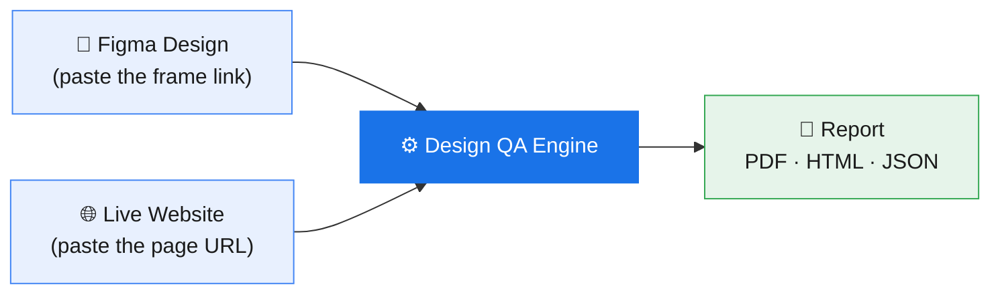
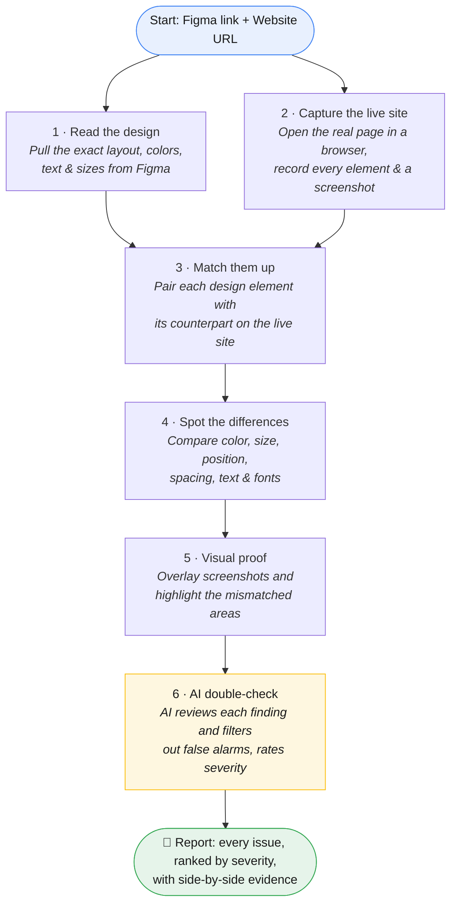
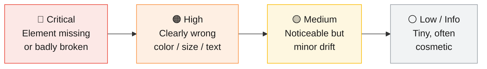
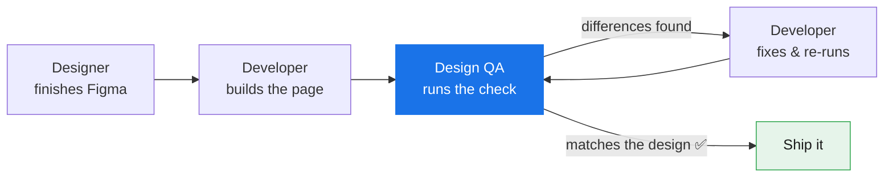

# Design QA — How It Works

**In one line:** You give it two things — your **Figma design** and your **live website** — and it gives you back a **report** of every place the build doesn't match the design.

---

## The big picture



> **Two URLs in, one report out.** No setup per page, no manual screenshots.

---

## What happens inside (step by step)



| # | Step | In plain words | What you get |
|---|------|----------------|--------------|
| 1 | **Read the design** | Pulls layout, colors, text, fonts and sizes straight from your Figma frame | The "source of truth" |
| 2 | **Capture the live site** | Opens the real page in a real browser and records every element + a screenshot | The "as built" snapshot |
| 3 | **Match them up** | Pairs each design element with the one on the live page | Knows what to compare to what |
| 4 | **Spot the differences** | Checks color, size, position, spacing, text and typography | A list of mismatches |
| 5 | **Visual proof** | Highlights the exact areas that look wrong on a screenshot | Side-by-side evidence |
| 6 | **AI double-check** | AI confirms real problems vs. noise and ranks how serious each is | A trustworthy, prioritized report |

---

## How issues are graded

Each finding is ranked so your team fixes what matters first:



---

## Where it fits in your workflow



It can run **on demand** (a person clicks "run") or **automatically** as part of the release process, blocking a release if serious mismatches are found.

---

### Plain-text version (for slides / email)

```
   FIGMA DESIGN ─┐
                 ├──►  [ DESIGN QA ENGINE ]  ──►  REPORT (PDF / HTML / JSON)
   LIVE WEBSITE ─┘

   Inside the engine:
   1. Read the design   →  2. Capture the live site
                  \           /
                   ▼         ▼
   3. Match elements  →  4. Compare (color · size · position · text · fonts)
                            ▼
   5. Highlight differences on screenshots
                            ▼
   6. AI filters false alarms + ranks severity
                            ▼
      REPORT: issues ranked Critical → High → Medium → Low, with evidence
```
